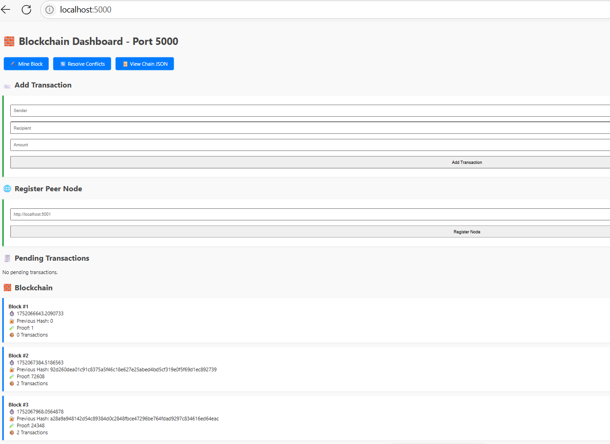
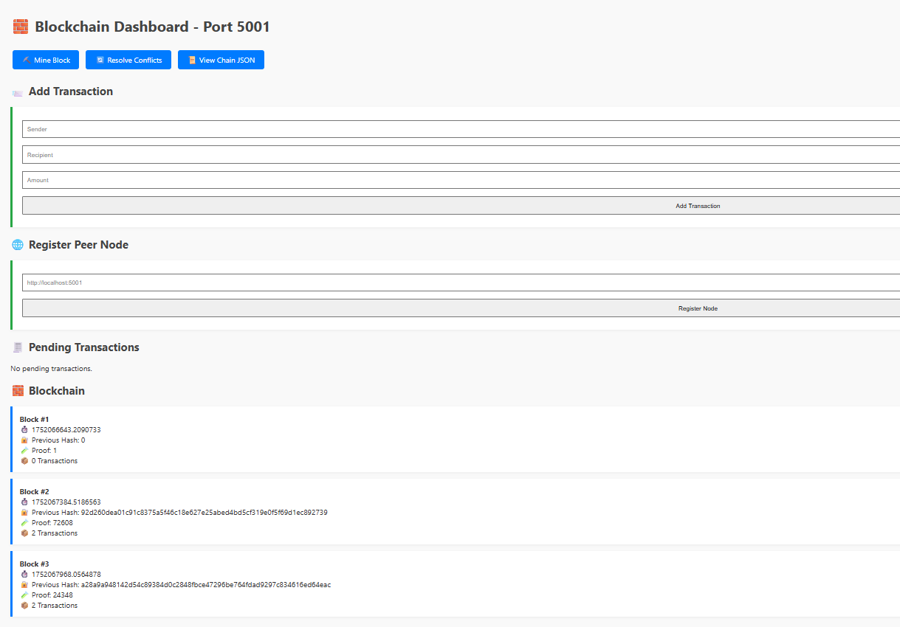
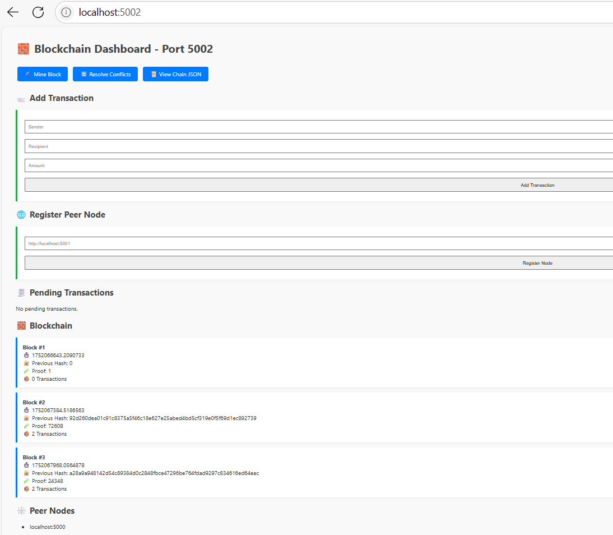
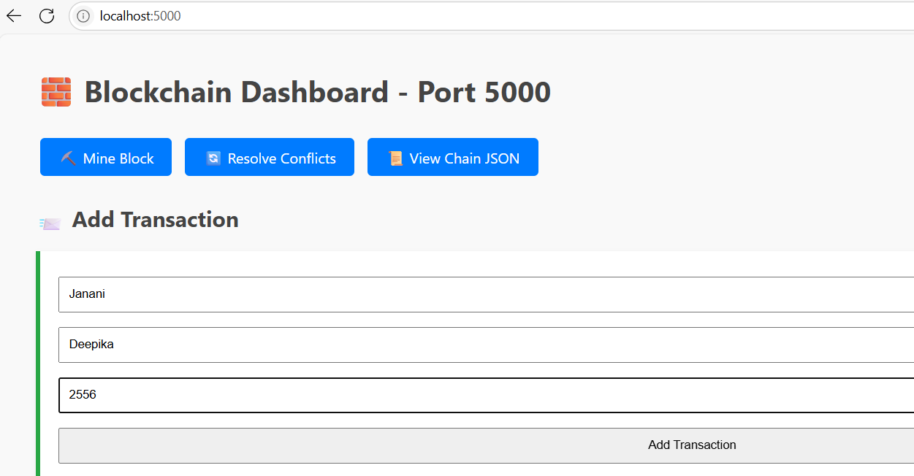
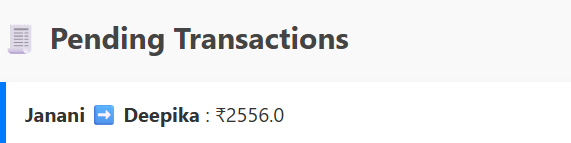
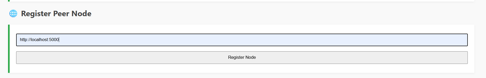
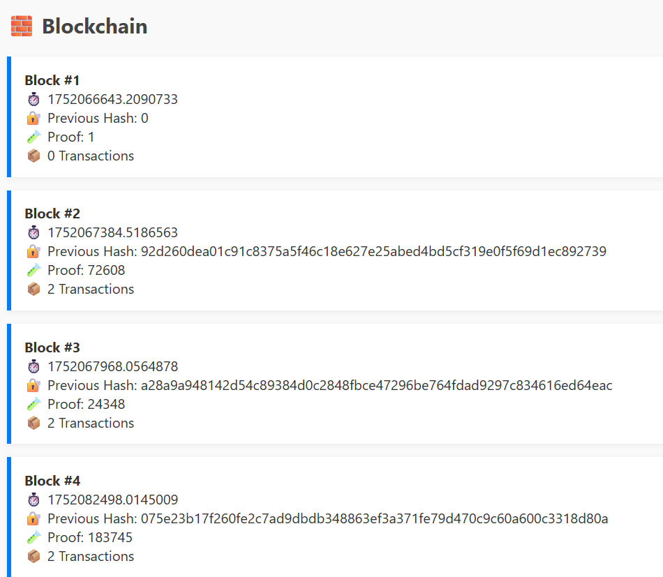
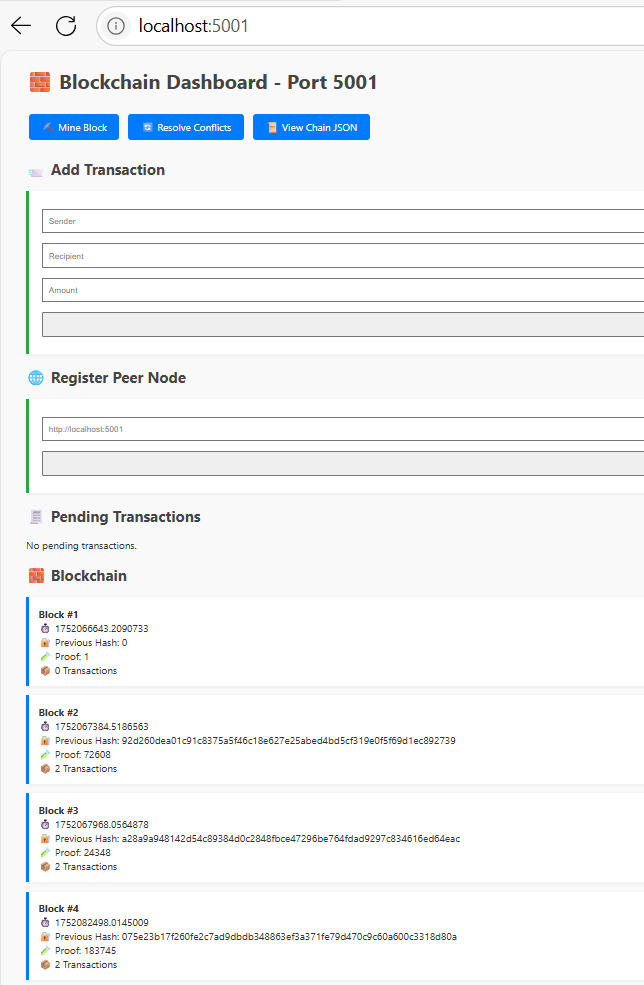
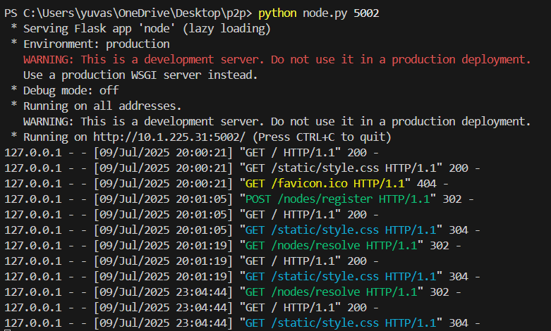

## P2P Blockchain Simulation

This project simulates a Peer-to-Peer (P2P) blockchain network using Python, Flask, and HTTP communication. 
Each node maintains its own blockchain, mines blocks with Proof of Work (PoW), registers peers, and resolves conflicts to stay in sync with the longest chain rule.

## Features

- Add new transactions via a web form
- Mine blocks with basic Proof of Work(PoW)
- View blockchain in JSON
- Register peer nodes
- Sync chains using the "longest chain wins" consensus
- Web dashboard for user interaction (HTML + CSS)

## Tech Stack

- Python 3.x
- Flask (web framework)
- requests (for peer-to-peer HTTP communication)
- HTML/CSS (Flask templates for dashboard)

## ⚙️ Working

This project simulates a fully decentralized peer-to-peer blockchain network, where each node (Flask server) independently maintains a copy of the blockchain, mines blocks, and communicates with other peers over HTTP. Here's a breakdown of how the system works:

### 🧩 1. Node Structure
Each instance of `node.py` represents a node in the network:

- Runs on a unique port (e.g., 5000, 5001, 5002)
- Maintains its own copy of the blockchain
- Has the ability to mine, transact, and sync with peers

---

### 📝 2. Transactions
Users can submit new transactions via the web interface. These transactions:

- Contain `sender`, `recipient`, and `amount`
- Are temporarily stored in a transaction pool (`current_transactions`)
- Wait to be mined into a block

---

### ⛏️ 3. Mining & Proof of Work (PoW)
Mining performs two key tasks:

- Solves a PoW problem — it finds a number (nonce) such that the hash of the previous proof and current guess starts with four leading zeroes (`0000`)

Once solved, it:

- Creates a new block
- Adds all pending transactions into the block
- Rewards the miner with 1 unit of coin
- Appends the block to the local chain

This PoW system ensures computational effort and resists spamming or fraud.

---

### 🌐 4. Registering Peer Nodes
Nodes can register other peer nodes using their `IP:PORT`. Once registered:

- The node keeps track of peer addresses
- Enables network-wide communication and chain sharing

---

### 🔄 5. Conflict Resolution & Consensus
In a real blockchain, different nodes might have slightly different chains due to timing delays. To maintain consistency:

- The system uses a simple consensus algorithm: **Longest valid chain wins**
- When `/nodes/resolve` is triggered:
  - The node fetches all peer chains
  - Validates them for hash integrity and PoW correctness
  - If a longer valid chain is found, it replaces its own

This mechanism ensures the network converges to a **single consistent version** of the blockchain.

---

### 📜 6. Viewing the Blockchain
Users can:

- View the full blockchain in a readable JSON format via the `/chain` endpoint
- See each block's:
  - Index
  - Timestamp
  - Transactions
  - PoW
  - Previous hash link

---

### 🖥️ 7. Web Dashboard
A responsive dashboard is provided where users can:

- Add transactions through a simple web form
- Mine new blocks with one click
- Register peer nodes by submitting their addresses
- Resolve conflicts to sync chains
- Visually view pending transactions and all blocks in a scrollable UI

### 📽️ Demo Video
🎬 [Click here to watch the demo video](demo_video/Demo%20video.mp4)

### **Dashboard View**

### **Node 2**

### **Node 3**

### **Adding Transaction**

### **Pending Transaction before mining**

### **Peer Node Registering for Node 2**

### **Mining Block in Node 1**

### **Resolving Conflicts in Node 2**

### **logs**
